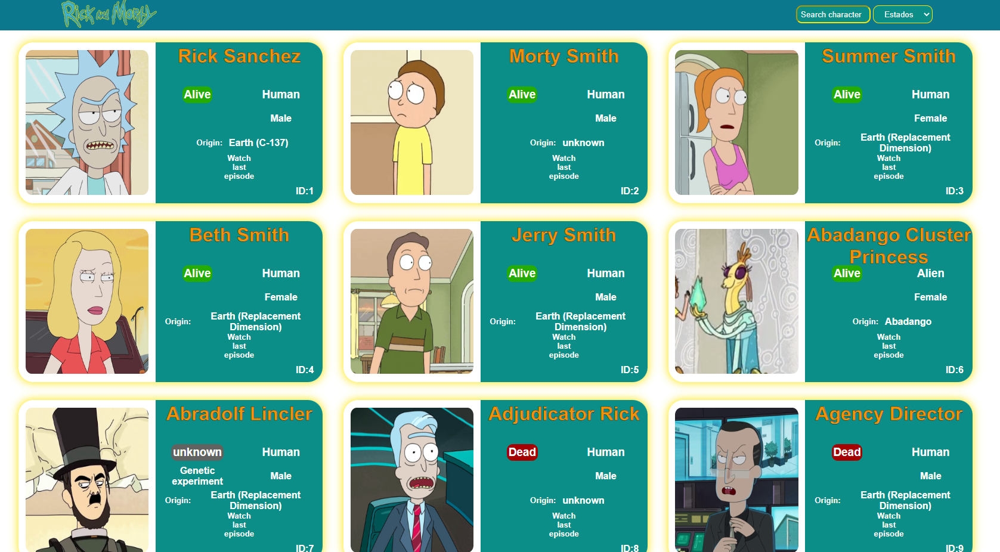
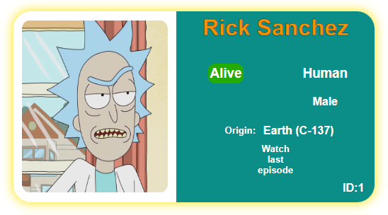
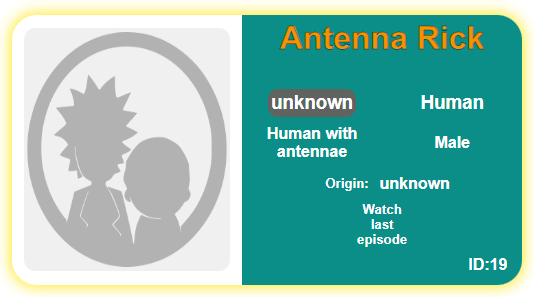
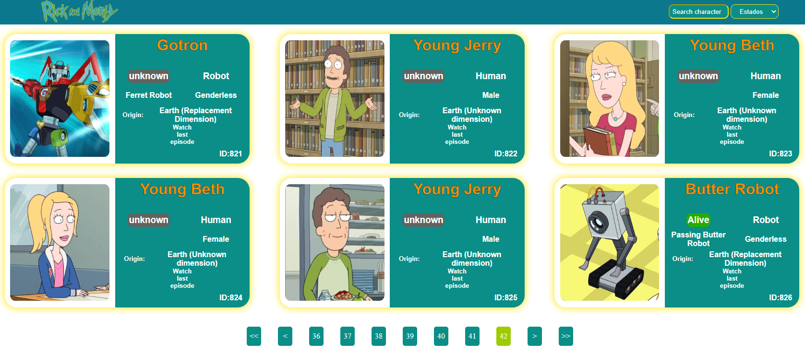
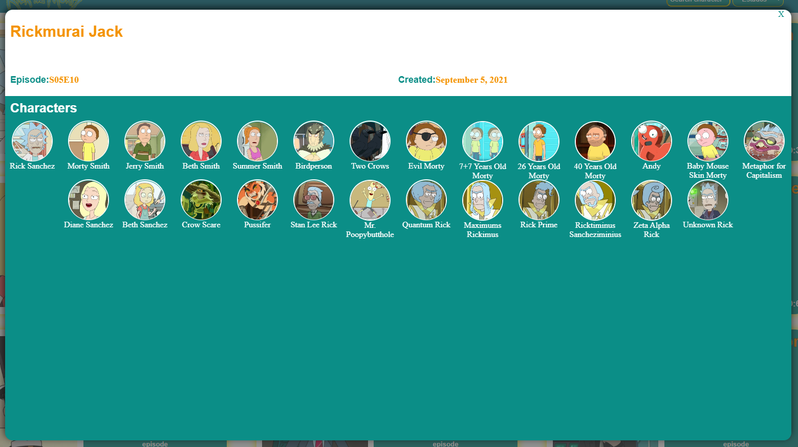
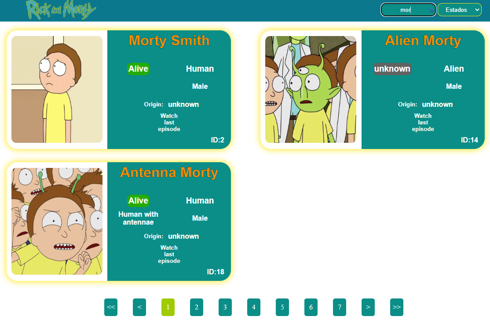
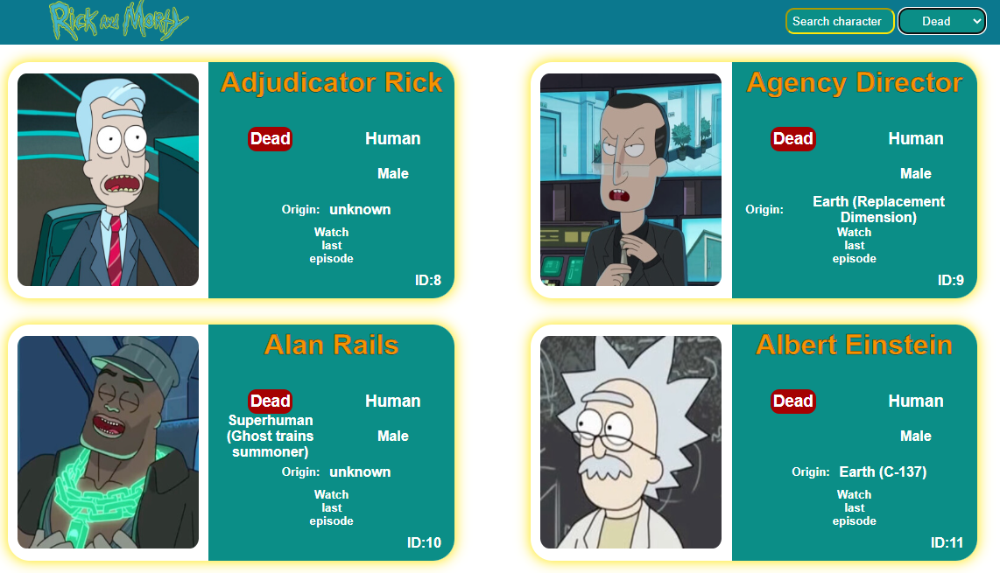

# Proyecto JavaScript Avanzado

[Ver este proyecto](https://sato31.github.io/Proyecto-JAvanzado-Dev.f/)

Este proyecto consistió en hacer un catálogo de personajes de la serie Rick and Morty. Cada personaje cuenta con su tarjeta que muestra la información obtenida desde [esta](https://rickandmortyapi.com/) API externa.

La información que se muestra en cada tarjeta es:

* Imagen del personaje
* Nombre
* Estado (Live, Dead o Unknown)
* Especie
* Tipo
* Género
* Origen
* Enlace para ver información del último episodio
* ID

Si el personaje no cuenta con imagen, aparece de esta forma:

Al final de la página se muestra la paginación para desplazarse a las demás paginas de personajes, a la primera, a la siguiente, a la anterior y a la última.

Al darle click en la opción "Watch last episode" se despliega un modal con la información del último episodio donde aparecio el personaje:

La información mostrada es:

* Nombre del episodio
* Número de episodio y temporada
* Fecha de emisión
* Imagen y nombre de personajes que aparecen en ese episodio

Para cerrar el modal se selecciona la cruz en la parte superior derecha.

La página incluye 2 filtros de búsqueda:

* Por nombre
* Por estado

Al ir escribiendo en el input de búsqueda, la lista de personajes se actualiza automaticamente, si se borra lo escrito en el input, se muestran los personajes correspondientes a la página en la que se encuentren.

El selector de estado filtra los personajes de acuerdo a los tres estados existentes.

